## 1. 程序总体说明

在实验四中，我的代码基于实验一、二、三迭代过来，完成了对C语言子集的中间代码生成，以及MIPS目标代码生成，并完成了选做要求，对函数的定义与调用进行了处理。

能够支持的类型包括布尔类型以及整数类型。而类型检查以及翻译已经在实验三完成。

能够支持while、if语句、return语句、函数调用、函数定义语句。以及子集中提到的所有运算符，并能够处理这些运算符的优先级以及结合性问题。同时能够处理加分项中的if-else语句。

能够支持C98标准中定义的运算符的优先级以及结合性。

将变量值存储在了内存中，使得在内存允许的情况下能够支持几乎无限数量的变量。

最后生成的目标代码测试了实验指导书所给的样例以及另外2个自定义测试程序，均能在MARS模拟器上正确运行。


程序大致分为以下几个部分：

1. 中间代码的四元式维护与MIPS目标汇编的转换
2. 存储分配
3. 抽象语法树翻译为四元式
4. 特殊函数的处理（get和put）
5. MIPS目标代码的生成

本次实验所改动的代码均位于我提交压缩包中的`compile.hpp`部分，并在`main`函数中进行了调用。

## 2. 中间代码的四元式维护与目标代码转换

我定义了一个结构体用于维护中间代码的四元式。

在其中存储op、arg1、arg2、result。并编写了翻译为MIPS目标代码的方案。

而由于程序中存在相当多的ALU运算指令，例如`add`、`sub`、`mul`、`and`、`xor`、`slt`等，对于这些指令，由于它们到MIPS目标代码的格式均为`op result,arg1,arg2`，因此对于这样的指令我采用直接进行字符串拼接的方式进行翻译（也就是源代码中的最后一个else的情况）。

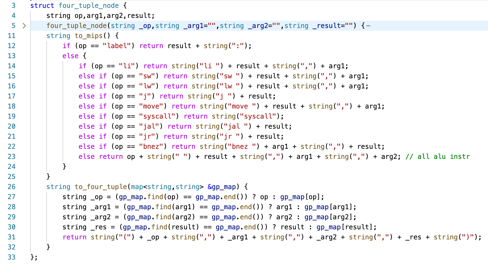

然后，对于这些四元式，在生成中间代码过程中，采用了一个vector进行记录，并使用一个`std::map`来处理中间代码与目标MIPS汇编的转换映射关系，代码如下：

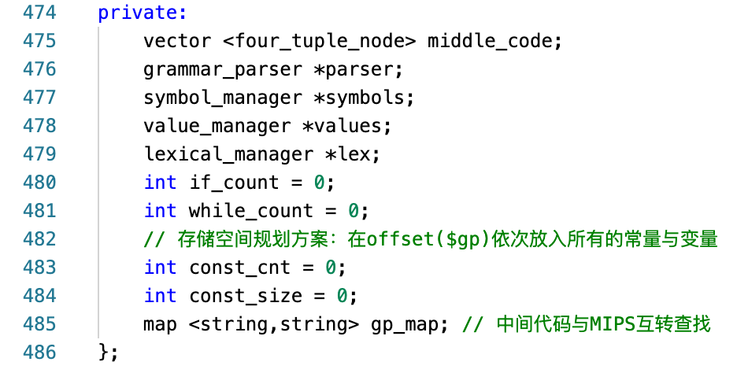

## 3. 存储分配方式说明

在本次实验中，我采用了静态存储分配方式，并且将变量的值都存储在内存中，在运算之前都使用Load(MIPSL为lw)读取到寄存器中，并在运算结束后进行Store(MIPS为sw）。这一方式虽无法进行函数的嵌套，但实现起来比较容易，并已经比实验要求的只使用寄存器更加完善。

另一个好处是，这种做法在面对函数调用之后，能够保留原函数的现场状态到内存，避免函数调用之后破坏原始函数的寄存器状态。

由于MIPS架构中存在一个全局指针寄存器`$gp`，因此，对于变量的值，我采用`offset($gp)`的方式来决定变量存储的地址空间。

在这里，我假定了变量的类型均为4 Bytes，然后先使用li以及sw指令将常量存入内存中，这样不同的常量也只需要在内存中存储一次，节省了存储空间。

然后按照先常量后变量的顺序，根据其本身在符号表的位置顺序分配内存。

对于常量的初始化部分代码如下（位于源程序的compile.hpp）：

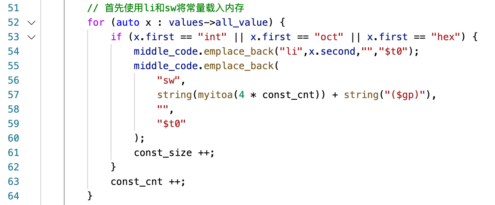

其中，values是常量表，通过对常量表中的值进行遍历，以及记录对应的id，（也就是const_cnt变量），编译为中间代码。

这里需要注意的是，由于每个常量需要占用4个字节的空间，因此存储上也需要将最终结果乘以4。

而对于变量，则是采用`4*(const_cnt+变量对应的符号表id)`来计算确切的内存地址，由于代码中涉及到的访存的翻译很多，这里以在语法树的赋值语句翻译为例（位于源程序的compile.hpp）：

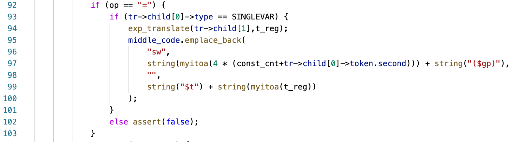

可以看到，通过`4*(const_cnt+它在符号表中的位置)`计算出了变量所存储的内存地址，然后使用了`Store`语句存入内存。

## 4. 抽象语法树翻译为四元式

对于抽象语法树翻译为四元式，主要分为一下几类：

- 算术与赋值语句语句
- 逻辑运算语句
- 变量与常量
- 代码块语句
- IF语句
- WHILE语句
- 变量声明语句
- 函数声明语句
- RETURN语句
- 函数调用语句

代码框架如下：

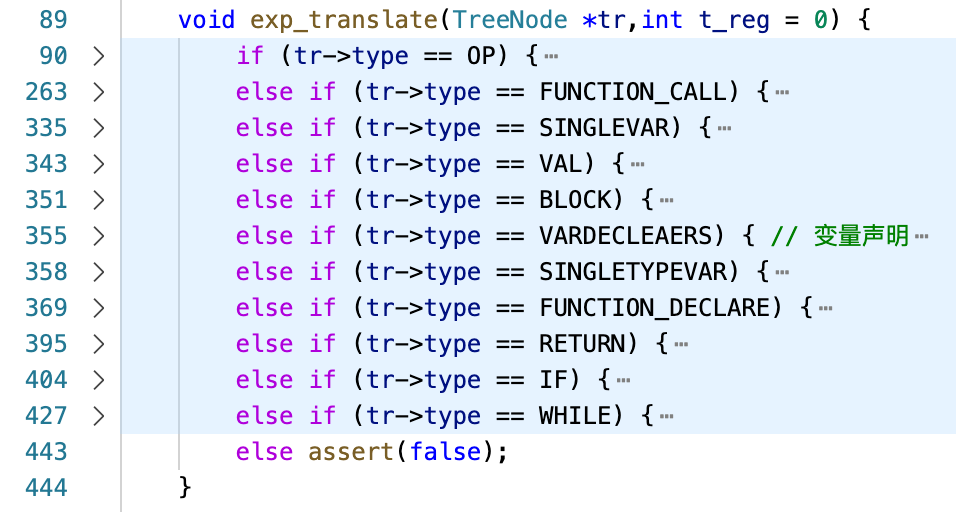

而为了简化过程，我的四元式中使用的`OP`按照了MIPS的方式进行了定义，这样方便了之后转换为MIPS，而在输出的四元式的时候再还原为四元式中`OP`的格式，方便人眼查看以及Debug。

### 4.1. 算术与赋值语句

对于算术与赋值语句，由于我已经在实验二完成了抽象语法树的建立，且对于算术语句我保证了一定为2个子节点（对于`!`、`++`这样的单运算符特殊语句采用左节点为NULL特殊处理），因此这一部分的抽象语法树一定是二叉树。

因此，对于我之前建立的抽象语法树，可以通过对这颗二叉树采用二叉树的后序遍历的方式来得到三元式，而在三元式中加上最终结果的地址即可变为所需要的四元式。

最后编写代码如下：

（其中exp_translate是这个函数本身，采用递归方式对语法树进行后续遍历）

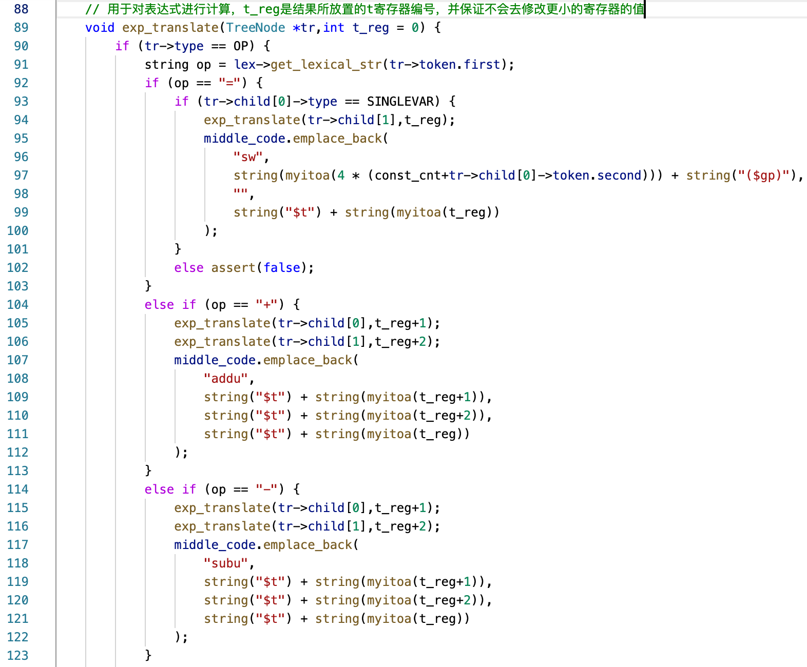

这里可以看到，对于这些运算符，都进行了后续遍历，来产生所需要的四元式代码，然后再根据根节点的运算符类型进行处理，进行翻译。

### 4.2. 逻辑运算语句

对于逻辑运算语句，由于部分指令对于我们最后的目标代码MIPS并没有相对应的一条指令，因此，对于这部分指令需要采用其它方式进行替代。

其中，由于在实验三已经完成了运算类型的检查，并强调了布尔类型不能与整数类型进行计算（尽管真实的C语言可以），因此在实验四中这一部分实质上是简化了。对于`!`语句可以翻译为`xori $t,$s,1`，对于`||`以及`&&`都可以简单地使用`or`和`and`进行翻译，当做是位运算符中的`|`以及`&`。

因此，对于`<`、`>`、`<=`、`>=`、`&&`、`||`、`!`这些逻辑运算符，翻译方法同算术语句，最后的翻译阶段使用对应的指令替代即可，这里以`&&`和`&`为例，代码如下（其它指令只是修改运算符的翻译）：

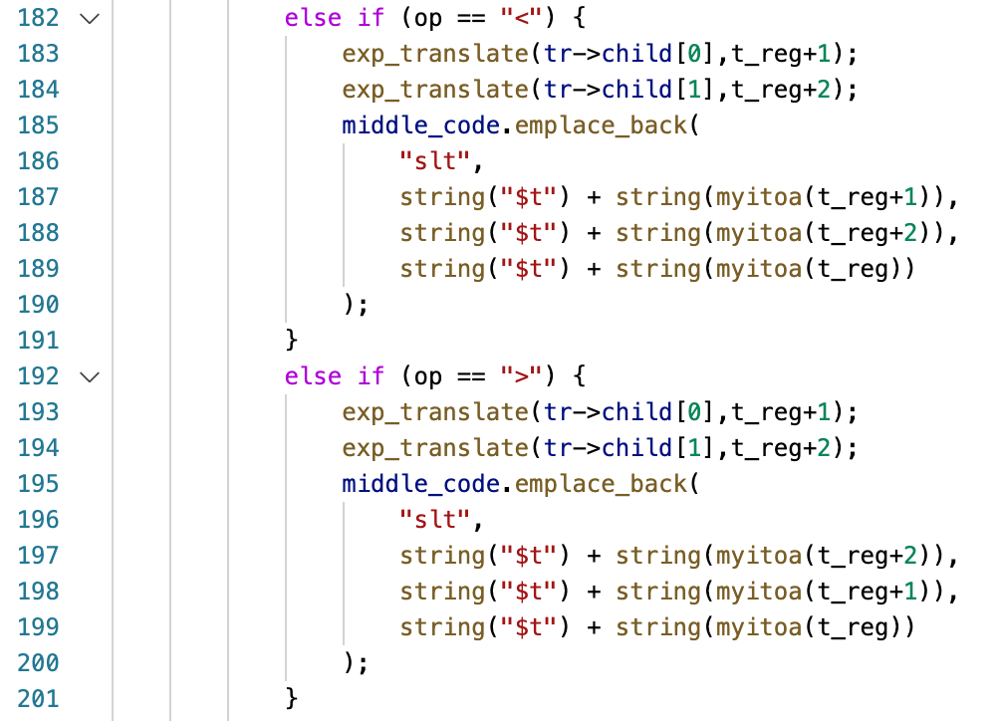

而对于`==`和`!=`这两条语句，它的翻译上比较麻烦。

这里我借鉴了GCC生成的汇编结果。安装了交叉编译工具，使用了`mipsel-linux-gnu-gcc -S`尝试了对目标代码进行生成，发现GCC在对MIPS目标翻译`==`采用的方法是先进行`xor`异或，然后使用`slt`来判断是否小于1来得到是否为0，若为0则为真。这种方法翻译`==`语句就只需要2行mips汇编，且真实场景不会因为branch指令导致CPU流水线刷新导致实际执行的时钟周期数较高。

而对于`!=`语句，只需要在`==`翻译结果的基础上对`1`进行异或即可，代码如下：

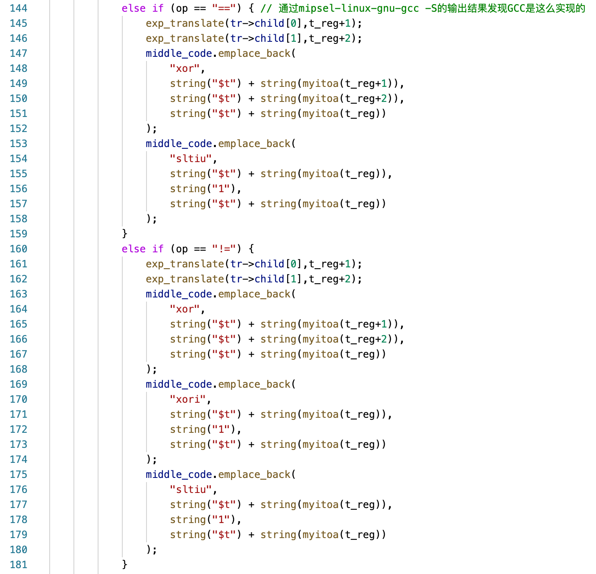

### 4.3. 变量与常量

对于前面所做的运算符翻译，由于运算符继续向下递归可以递归到变量、常量、函数调用这样的语句，因此在这里先对变量与常量进行处理。

而由于我已经在抽象语法树上存储了对应的token，而里面已经存储了它在符号表和常量表的对应位置，因此按照之前所述的存储分配方案直接翻译为`Load`对应的地址即可，如下：


### 4.4. 代码块语句

代码块语句的翻译是这其中最简单的，只需要递归它的每一个子节点继续翻译即可，代码如下：

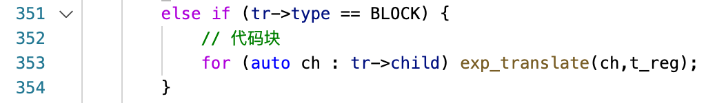

### 4.5. IF语句

到了if语句，就需要用到标签来作为跳转的地址了。

这里考虑先对`if(表达式)`中的表达式进行计算，然后根据表达式的计算结果，使用`j!=0`的操作，也就是MIPS指令中的`bnez`（Branch If Not Equal Zero）进行翻译。

整体框架大致如下：

```asm
# 先把表达式结果计算到寄存器$t0
bnez $t0,if_true
j if_else
if_true:
# 放入为真时的代码块
j if_end
if_else:
# 放入为假时的代码块
if_end:
```

而针对`if`没有`else`的情况，还可以继续简化，删除`j if_end`和`if_end:`，来简化目标代码的复杂程度。

最后编写代码如下：

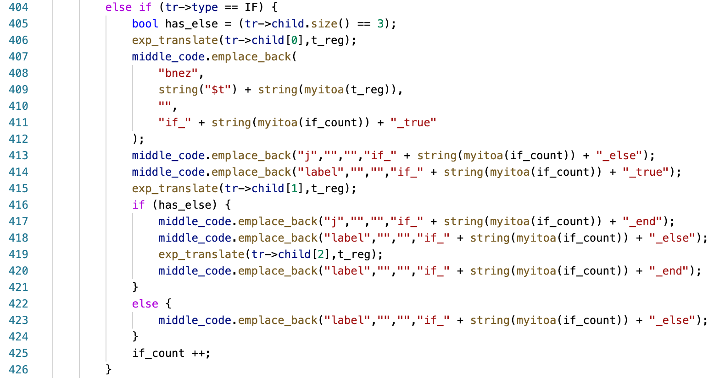

### 4.6. WHILE语句

对于while语句，采用的翻译方式和if类似，大致结构如下：

```asm
: while_x
# 中间插入表达式的计算代码，结果放入$t0寄存器
bnez $t0,while_x_true
j while_x_end
: while_x_true
# 插入while的代码块
j while_x
: while_x_end
```

最后编写代码如下：

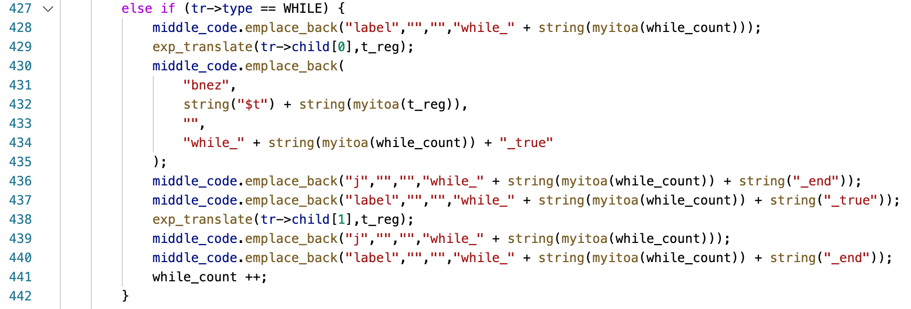

### 4.7. 变量声明语句

由于符号表已经在实验三中完成，因此在这一阶段只需要考虑变量声明语句中的初始值进行翻译即可，代码如下：

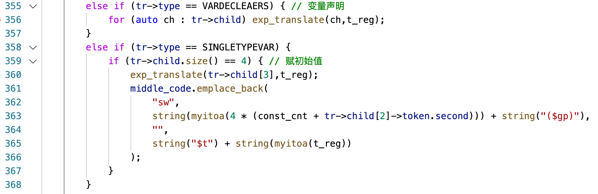

### 4.8. 函数声明语句

对于函数声明语句，主要考虑以下两个问题：

- 参数传递
- 返回值的传递

首先解决参数传递问题，在MIPS编程中，通常将`$a`寄存器作为参数传递的寄存器。

因此，在调用之前，我将参数传入对应的寄存器。然后调用`jal`语句跳转到对应的函数。而对于MIPS指令集而言，使用`jal`语句会带来一个方便的副作用，`$ra`寄存器会被赋值为跳转指令出的下一条指令的PC（程序计数器）值，这样对于函数调用的返回，也就可以使用`jr $ra`来返回到原有的函数。

而调用到对应函数后，首先需要根据参数数量将a寄存器的结果存储到对应的变量中，防止继续调用导致的改变。

因此，对于函数声明语句，翻译结构如下：

```asm
函数名:
# 首先保存参数
	sw $a*,变量对应的内存地址
# 放置函数的代码块
	jr $ra
```

而对于main函数，需要在最后让程序停止。

考虑到是在MARS模拟器上跑，而查阅MARS模拟器的手册后发现，MARS模拟器可以通过系统调用10来停止程序，因此对于main函数的结构如下：

```asm
main:
# 放置main函数代码块
	li $v0,10
	syscall
```

这样，main函数停止后，程序就会停下来。

最终翻译代码编写如下：

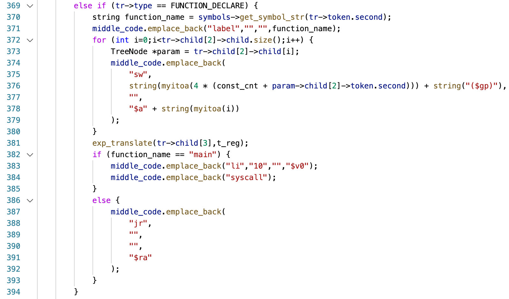

### 4.9. RETURN语句

对于RETURN语句的翻译，由于MIPS架构通常使用`$v0`寄存器放置返回值，在函数调用处去读取`$v0`寄存器的值，因此编写代码如下：

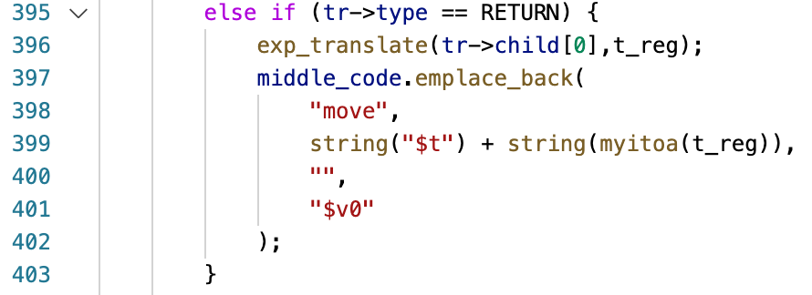

### 4.10. 函数调用语句

对于函数调用语句，要分为两种情况：

1. 给定的get和put语句
2. 自定义的函数的调用

#### 4.10.1. 给定的get和put语句

对于这两种语句，需要考虑目标的操作系统和机器的系统调用类型。

对于MARS模拟器而言，它的定义如下：

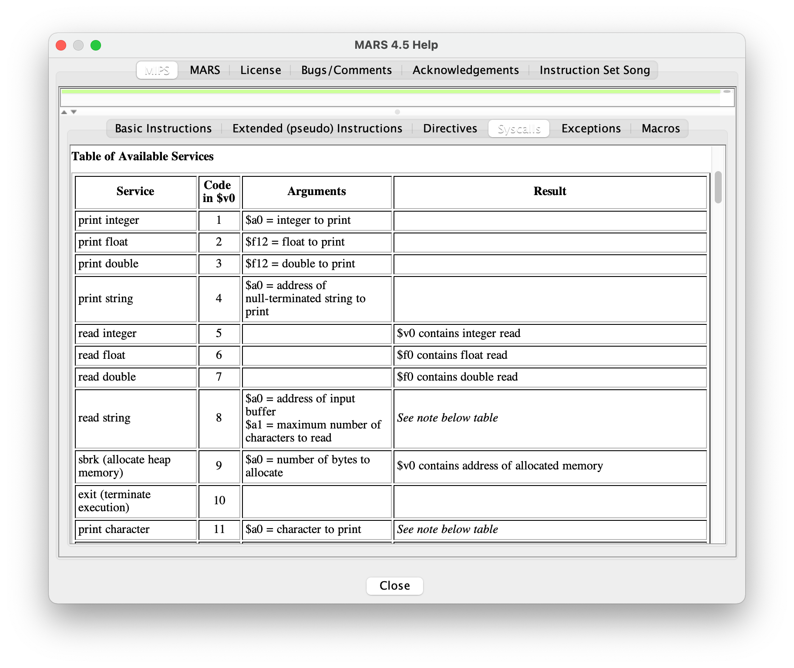

这里可以看到，对于输出一个整数，使用系统调用`1`，然后将要输出的整数放入`$a0`寄存器即可。

而对于输入一个整数，则是使用系统调用`5`，然后读取`$v0`的数值作为输入整数的结果。

而在输出上，为了方便观看，我在每次get时都加入了一个换行符，这里可以使用系统调用`11`，然后将`\n`的ASCII码，也就是10放入`$a0`寄存器即可。

最后编写代码如下：

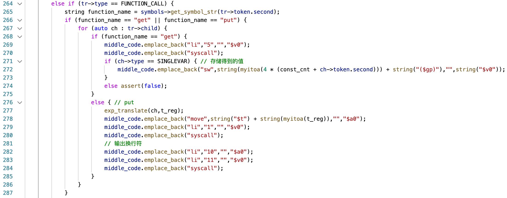

#### 4.10.2. 自定义的函数

对于自定义的函数就非常简单，只需要先将参数放入`$a`寄存器，然后使用`jal`调用即可。`jal`指令在CPU内部会自动存储当前的下一条指令到`$ra`，因此调用后可以通过这样的方式返回。

最后编写代码如下：

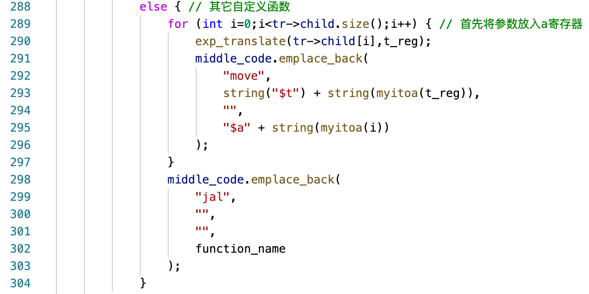

## 5. 错误处理

由于到了目标代码生成阶段不应该出现错误，因此本质上这个阶段是不需要错误处理的。而由于我的实验四代码是基于之前实验一、二、三的代码迭代而来，因此它实际上可以处理在之前的实验中已经做的所有的错误处理。

## 6. 代码的运行

Makefile：

`make test[1-5]`