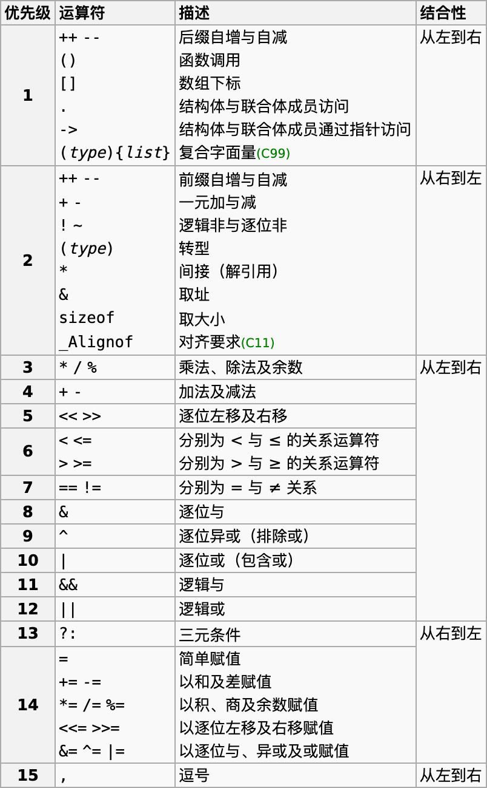
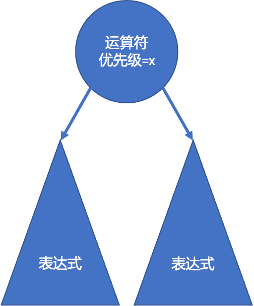
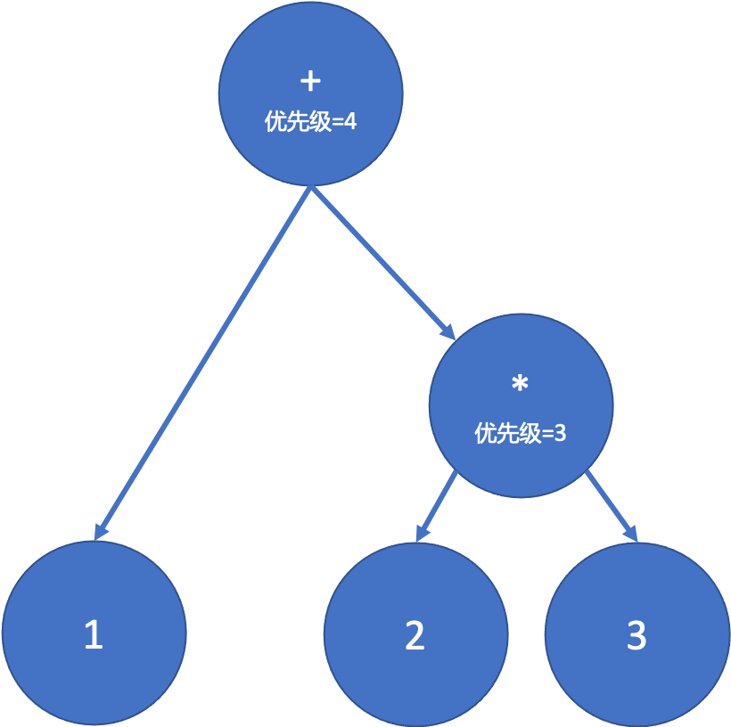
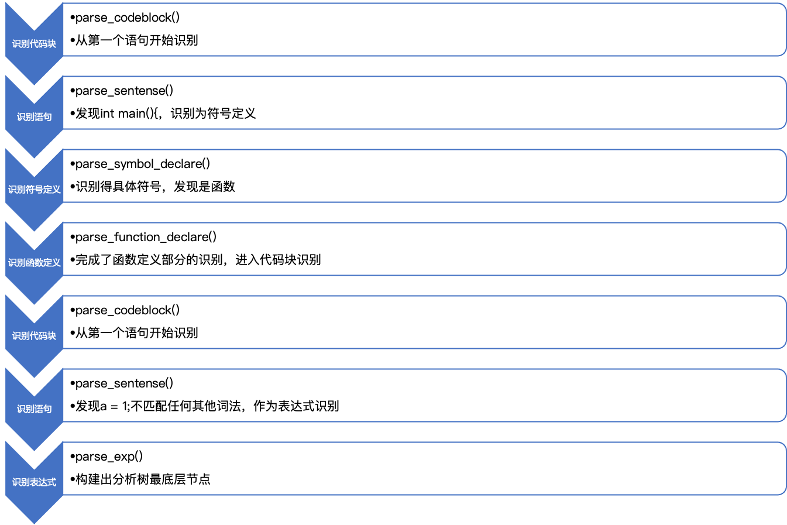
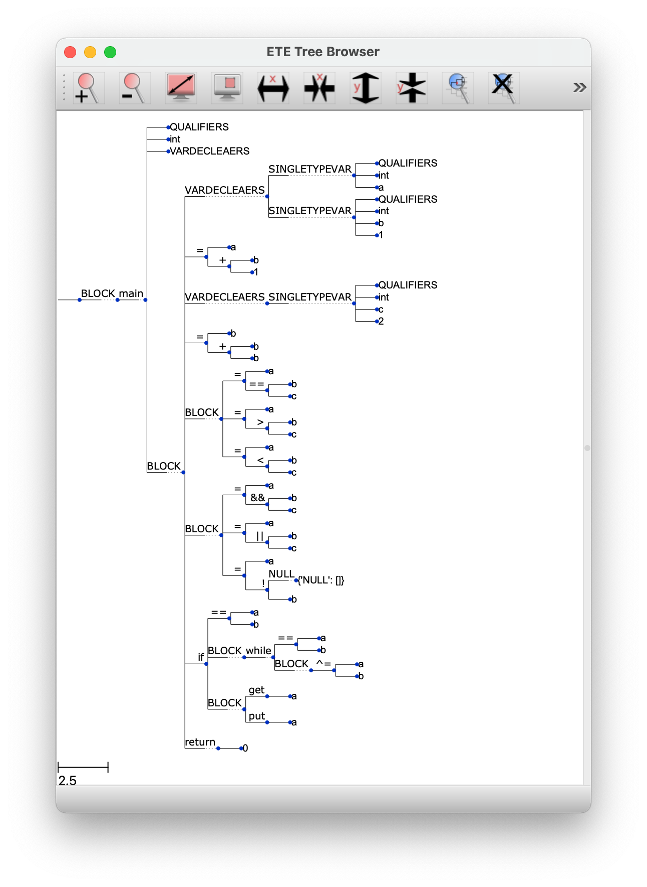
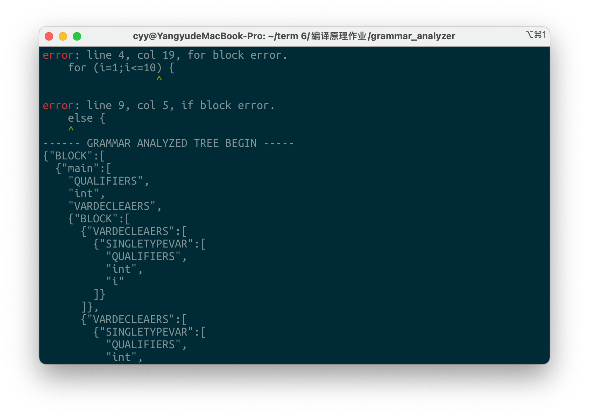
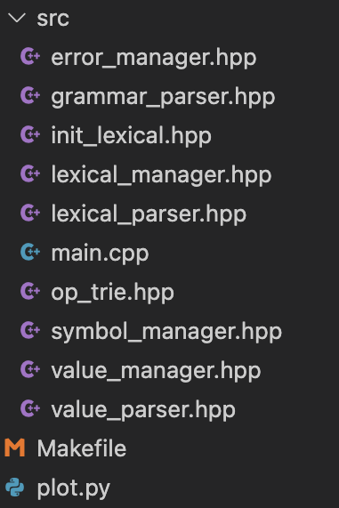

## 1. 语言说明

本语法分析器中实现了**函数定义**、**函数调用**、**变量定义**、**if条件语句**、**if-else条件语句**、**while循环语句**、**for循环语句**、**函数调用**、**多级指针**、**多维数组**、**代码块**、**return**语句。

- 在运算符上：支持C98标准中定义的所有运算符，并正确处理了左右结合性以及优先级的问题。
- 在类型修饰符上：支持C98标准中定义的所有类型修饰符。
- 在类型上：支持C98标准所有的类型。

语言描述如下：

*注：以下所说的**符号**指**Symbol**，而非**Operator**。*

### 1.1. 表达式

在处理表达式之前，首先需要考虑运算符，根据cppreference网站上查阅的资料，C语言的运算符如下：



表达式中需要注意的是，C语言中还有一元运算符。例如`!`、`~`、`++`、`--`，甚至还有`+`和`-`也可以作为一元运算符使用。此外，对于同样的符号也有左右结合的情况。归纳后我们定义以下文法：

```
<可用数值> ::= <子表达式> | <常量> | <符号调用> | <一元运算结果>
<一元运算结果> ::= (<运算符> <表达式>) | (<表达式> <运算符>)
<表达式> ::= <可用数值> | (<运算符> <表达式>)
```

这里尽管没有消除左递归，是由于这里符号较多，我们如果采用一条条文法表示的方法内容非常长，而编程上亦是如此。

因此在我的程序中尽管大的部分采用了递归下降，但**处理表达式**采用的是根据结合性和优先级构建二叉分析树的方法：每个非叶节点都是运算符。然后将表达式变成一颗二叉树进行处理。这样的做法是顺序扫描符号的，因此不会导致程序陷入死循环。

具体方法详见实验报告的第二部分。

### 1.2. 类型

```
<类型> ::= {"void","int","long","short","float","double","char","unsigned","signed","struct","union","auto","enum"}
<识别类型> ::= (<'struct'>|<'union'> <'用户自定义类型'>) | <类型>
```

### 1.3. 类型修饰符

```
<类型修饰符> ::=
{"const","static","volatile","register","inline","extern","restrict"}
<多个类型修饰符> ::= <空集> | <类型修饰符> <多个类型修饰符>
```

*注：考虑到后续使用的多个类型修饰符也可以为空*

### 1.4. 指针

```
<指针> ::= <空集> | <'*'> <指针>
```

*注：考虑到后续使用时可以为空*

### 1.5. 数组符号定义

```
<一维数组> ::= <'['> <表达式> <']'>
<数组> ::= <空集> | <一维数组> <数组>
```

### 1.6. 变量定义

```
<单个变量定义> ::= <指针> <符号名> <数组> (<空集>|<'='><表达式>)
<多个变量定义> ::= <单个变量定义> (<空集>|<','><多个变量定义>)
<变量定义> ::= <多个类型修饰符> <识别类型> <指针> <多个变量>
```

### 1.7. 函数定义

```
<参数定义> ::= <多个类型修饰符> <指针> <参数名> (<空集>|<'='><表达式>)
<多个参数定义> ::= <空集> | <参数定义> (<空集>|<','><多个参数定义>)
<函数定义> ::= <多个类型修饰符> <指针> <函数名> <'('> <多个参数定义> <')'> <代码块>
```

### 1.8. 符号声明语句

```
<符号声明语句> ::= <变量定义> | <函数定义>
```

### 1.9. 语句

```
<语句> ::= <符号声明语句> | <表达式> | <if语句> | <while语句> | <for语句> | <return语句> | <'代码块'>
<多条语句> ::= <空集> | (<语句><多条语句>)
```

### 1.10. 代码块

```
<代码块> ::= <'{'><多条语句><'}'>
```

### 1.11. 符号调用

```
<参数使用> ::= <表达式> (<空集>|<','><表达式>)
<函数调用> ::= <函数符号><'('><参数使用><函数调用>
<符号调用> ::= <除函数外的符号><数组> | <函数调用>
```

*注：符号中函数与其他符号已在实验一的词法分析阶段通过判断定义时其后是否有括号进行了预处理。*

### 1.12. if语句

```
<if语句> ::= <if> <'('> <表达式> <')'> <代码块> (<空集>|<else><代码块>)
```

### 1.13. for语句

```
<for语句> ::= <for> <'('><表达式><';'><表达式><';'><表达式><')'> <代码块>
```

### 1.14. while语句

```
<while语句> ::= <'while'> <'('> <表达式> <')'> <代码块>
```

## 2. 语法分析方法

在本程序中，主要的语法分析方法采用的是递归下降。但对于表达式的识别则采用了手动顺序构建二元运算二叉树的方法。

### 2.1. 表达式的识别

首先，我们限定表达式转换为一颗二叉树，如下：



这里，我们建立一颗这样的表达式二叉树，对于每颗子树（单节点的树除外），其根节点都是一个运算符，下接两个子表达式。

特别地：对于一元运算符，例如`i++`，我们采用左子树为`i`，而右子树为`NULL`的方式来表示。

然后，我们需要在每个运算符节点存储该运算符的优先级，在树中优先级问题简化为：这棵树要满足自下往上优先级单调不降（相等或上升）。这样，我们可以根据上一个节点所在的位置向上遍历这棵树找到合适的插入位置。

此外还要考虑结合律，由于C语言中一个优先级一定只有一种结合律，而仅有优先级相同的时候才需要考虑左结合还是右结合的问题，因此我们只需要维护一个表格，在识别到新符号的时候能够得到结合律即可。

而对于相邻两个运算符优先级相同的情况下，我们需要考虑左结合与右结合的问题。如果是右结合则直接替换上一次的节点，然后将上一次的节点作为左子节点；如果是左结合，我们需要找到同样优先级的最高点，然后替换它作为左子节点。并记录新节点的位置，在下一次读取到数值的时候插入在该节点的右子节点。

例如：对于`1+2*3`，分析树构造如下：



归纳来说，将符号合并到分析树上按照以下流程：

1. 优先级相同，右结合：直接与上一次操作的节点结合

2. 优先级相同，左结合：从上一次操作的节点一直向上找到相同优先级的最高层，然后结合
3. 优先级不同且新符号优先级排名更高：直接与上一次操作的节点结合
4. 优先级不同且新符号优先级排名更低：
   1. 向上能够找到优先级相同的地方：根据结合性确定链上的位置，若右结合在相等链的最低端，若左结合则在相等链的最顶端
   2. 若向上不能找到优先级相同的地方：一直向上找到了第一个优先级大于的现在要插入运算符的节点，直接左结合

这一部分代码位于`src/grammar_parser.hpp:898`。

之后，根据前文提到的C语言运算符表我们可以发现，C语言中还存在同一运算符具有多种不同的意义的问题，这些意义下也有不同的优先级，这些运算符如下：

| 优先级 | 运算符 | 意义     | 结合方向 |
| ------ | ------ | -------- | -------- |
| 2      | -      | 一元减   | RL       |
| 4      | -      | 减法     | LR       |
| 1      | --     | 后缀自减 | LR       |
| 2      | --     | 前缀字减 | RL       |
| 1      | (      | 函数调用 | LR       |
| 2      | (      | 转型     | RL       |
| 1      | )      | 函数调用 | LR       |
| 2      | )      | 转型     | RL       |
| 2      | *      | 解引用   | RL       |
| 3      | *      | 乘法     | LR       |
| 2      | &      | 取址     | RL       |
| 8      | &      | 逐位与   | LR       |
| 2      | +      | 一元加   | RL       |
| 4      | +      | 加法     | LR       |
| 1      | ++     | 后缀自增 | LR       |
| 2      | ++     | 前缀自增 | RL       |

基于以上运算符，我们发现：这些相同的运算符结合方向都不一样。因此我们可以在程序中记录上一次所读取的类型属于数值还是符号（对于括号或者一元运算符的结束认为数值处理），这样就可以直接区分出对应的结合方向，从而得到当前符号的具体含义。也就得到了对应的优先级。

这一部分代码位于`src/grammar_parser.hpp:226`

### 2.2. 总体语法的识别

除表达式外，总体语法识别采用了**递归下降**方法。由于除了表达式外，我们定义的其它文法已经**消除了左递归**，因此可以采用递归下降从左至右的分析方法。这样的方法也方便我们处理各种各样的语法嵌套。同时，由于我们语法定义明确，拆分清晰，并对符号表在词法分析阶段进行了类型的预处理（识别符号的类型是否为函数和结构体以及普通变量），因此我们的递归下降算法并不存在回溯，程序语法分析的算法实现了关于记号流长度的线性复杂度**O(n)**。

在程序中，拆分为了以下函数进行识别：

```c
int parse_exp(int start_pos,TreeNode **rt); // 表达式
int parse_qualifiers(int start_pos, TreeNode **rt); // 修饰符
int parse_function_with_param(int start_pos, TreeNode **rt); // 函数调用
int parse_if(int start_pos, TreeNode **rt); // if语句
int parse_while(int start_pos, TreeNode **rt); // while语句
int parse_return(int start_pos, TreeNode **rt); // return语句
int parse_for(int start_pos, TreeNode **rt); // for语句
int parse_sentense(int start_pos, TreeNode **rt); // 单条语句
int parse_codeblock(int start_pos, TreeNode **rt)； // 代码块
int parse_sym_with_array(int start_pos, TreeNode **rt); // 数组
int parse_var_declare(int start_pos, TreeNode **rt, TreeNode *qualifiers)； // 变量声明
int parse_function_declare(int start_pos, TreeNode **rt, TreeNode *qualifiers); // 函数定义
int parse_symbol_declare(int start_pos, TreeNode **rt); // 符号声明：变量和函数都属于此类
```

这其中，比较复杂的是符号的识别。由于符号识别前面可能包含类型和修饰符甚至还有指针。因此我采用的方法是：

1. 检测到类型词或者修饰符词后，调用符号定义函数`parse_symbol_declare`

2. 记录当前记号流指针所处位置，记为checkpoint。

3. 一直读取到符号本身，根据词法分析阶段的预处理结果判断该类型属于函数还是普通变量。

   （预处理的具体方法是词法分析阶段建立符号后如果在语句结束符前遇到大括号`'{'`则修改符号类型为函数）

4. 使用checkpoint指针所在的位置递归进入相应的识别函数。

这一部分代码位于：`src/grammar_parser.hpp:861`

至于其他函数，则是直接按照语法规则由一些简单的if语句判定分支依次向下递归。这里就没有太大的难点了。

举例而言：

对于一个这样的程序：

```c
int main() {
  a = 1;
}
```

对于其中`a=1`语句的识别，我的程序的自顶向下调用栈如下：



## 3. 数据结构说明

这里在语法分析阶段定义的数据结构主要是**分析树**。

这里我考虑到分析树上每一种结构的的子节点数量不同，因此首先考虑用一个enum来记录各种分析树节点的类型，这样在后续的实验需要用到语义分析结果的时候只需要先读取该类型变量，然后按照这种类型所定义的各个子节点定义来处理即可。由于采用了动态数组`std::vector`，这种方法编写方便，也不会带来多余的内存占用，对于输出语法分析树也非常方便。

### 3.1. 分析树的类型定义：

```c
enum TreeNodeType {
    DEFAULT,
    FUNCTION_CALL, // 函数调用
    FUNCTION_DECLARE, // 函数定义
    RETURN, // return 语句
    QUALIFIERS, // 修饰符
    VARDECLEAERS, // 一组的变量声明
    SINGLEQUALIFIER, // 单个修饰符
    SINGLETYPEVAR, // 单个变量的声明
    SINGLEVAR, // 单个变量的使用（包含数组）
    TYPE, // 定义类型
    BLOCK, // 代码块
    EXP, // 表达式
    IF, // if
    FOR, // for循环
    WHILE, // while循环
    OP, // 操作符（保证一定二叉）
    SYM, // 符号
    VAL // 常量
};
```

这些类型的Token和Child定义用途在下一部分语法树中详细说明。

### 3.2. 分析树的结构体定义：

```cpp
struct TreeNode {
    TreeNode *fa; // 存储父节点，用于在表达式识别中构建的二叉树的向上寻找
    TreeNodeType type; // 上图定义的type
    pair<int,int> token; //原始的记号，这里与词法分析阶段输出的二元组相同
  	// 而对于除了常量和符号外的其它记号，它们不需要用到second，因此这里token的second可以用于存储其它内容来节省空间。
  	// 例如变量定义和函数定义中中它指的是指针级数，而对于操作符来说它指的是运算符的优先级。
    vector <TreeNode*> child; // 子节点，为了方便处理直接采用这样的形式，并在之后读取的时候先检测类型再依次读取
    bool error; // 该节点下是否有错误，在错误处理时使用
    TreeNode() {
        fa = NULL;
        type = DEFAULT;
        token = {-1,0};
        error = false;
    }
    void append_ch(TreeNode *node) { // 添加一个子节点
        if (node && !node->error) {
            assert(node->fa == NULL); // 避免多连接问题，assert起来方便发现开发中如果这里出错可以及时发现。
            node->fa = this; // 自动维护父节点
        }
        child.push_back(node);
    }
    const char* type_s() { ... } // 用于将type转换为字符串，方便输出语法树，由于代码太长所以这里省略了。
};
```

## 4. 语法树及输出说明

### 4.1. 语法树的节点定义

我定义的语法树根据节点类型不同定义也不同，按照类型定义如下：

#### 4.1.1. 函数调用(FUNCTION_CALL)

- Token: 存放函数的符号名的记号
- Child: 将每一个参数的整个表达式作为子节点，子节点数量取决于参数的数量。

#### 4.1.2. 函数声明(FUNCTION_DECLARE)

- Token: 存放定义函数本身的符号名的记号

- Child:

  0. 修饰符

  1. 类型 (类型的second存放指针级数)
  2. 多个参数 (类型为`VARDECLEAERS`，各个参数作为其子节点)
  3. 代码块

#### 4.1.3. 返回语句(RETURN)

- Token: 存放return本身的记号
- Child: 一个节点，存放`return`语句后接的表达式

#### 4.1.4. 单个修饰符(SINGLEQUALIFIER)

- Token: 修饰符本身的记号
- Child: 无

#### 4.1.5. 修饰符(QUALIFIERS)

- Token: 无
- Child: 按照修饰符的数量存放0个或多个`SINGLEQUALIFIER`

#### 4.1.6. 单个变量的调用(SINGLEVAR)

- Token: 存放变量本身的符号名的记号
- Child: 按照数组每一维的表达式放入Child，若不是数组则Child为空。

#### 4.1.7. 单个变量的定义(SINGLETYPEVAR)

- Token: 无，但利用Token.second存储指针的级数。

- Child:

  0. 修饰符

  1. 类型
  2. 定义变量的符号
  3. 初始值(允许为空)

#### 4.1.8. 多个变量的定义(VARDECLEAERS)

- Token: 无
- Child: 按照变量定义语句中的变量数量存放0个或多个`SINGLETYPEVAR`

#### 4.1.9. 类型定义(TYPE)

- Token: 类型本身的记号
- Child: 
  - 若为结构体或联合体，则该节点Token为`struct`或`union`本身的记号，然后Child存放定义的结构体名称符号。
  - 若为基本类型则没有Child。

#### 4.1.10. 代码块(BLOCK)

- Token: 无
- Child: 存放代码块中各语句，每个语句可以为任何类型。

#### 4.1.11. IF语句(IF)

- Token: 存放`if`本身的记号

- Child:

  0. 条件表达式

  1. 代码块
  2. Else代码块(允许为空)

#### 4.1.12. FOR语句(FOR)

- Token：存放`for`本身的记号

- Child：

  0. 初始化语句

  1. 条件语句
  2. 迭代表达式
  3. 代码块

*注：以上前3个Child在识别的时候都作为表达式来识别。*

#### 4.1.13. 二元操作符(OP)

- Token: 存放运算符本身的记号，Token.second存放运算符的优先级（用于表达式树的自底向上构建）。

- Child:

  0. 左操作数

  1. 右操作数

*注1：操作数可以是任何可以计算出结果的内容，包括运算符本身。*

*注2：对于单运算符，例如`i++`中的`++`，存储方式是将`i`作为左操作数，右操作数设置为NULL。*

#### 4.1.14. 符号(SYM)

- Token: 存放符号本身的记号
- Child: 无，这种类型一定为终结符

*注：这里的符号指的是**Symbol**，而非**Operator**。*

#### 4.1.15. 常量(VAL)

- Token: 存放常量本身的记号
- Child: 无，这种类型一定为终结符。

### 4.2. 语法树的输出

在程序中的输出，我采用将语法树输出为JSON格式，因为JSON格式可以直接存储一个对象，也可以直接在里面存放一个列表。进行一定的格式化后层次上也较为清晰。方便在之后为语义分析程序所使用。

#### 4.2.1. 详细版本的语法树的输出（JSON格式）

为了方便后续语义分析程序直接使用，这里输出了一个详细版本的语法树。代码见`src/grammar_parser.hpp:109`

对于单个节点JSON格式化如下：

```JSON
{
	"type":树节点的类型,
	"token":[token.first,token.second],
	"lex":词法的字符串，对于符号和常量，则为符号名和常量值，方便绘图使用
	"child": [
		子节点1,
		子节点2,
		...
	]
}
```

例如，对于一个语句

```c
int a = 1;
```

语法树输出如下：

```JSON
{
  "type":"VARDECLEAERS",
  "token":[-1,0],
  "lex":"NULL",
  "child":[
    {
      "type":"SINGLETYPEVAR",
      "token":[-1,0],
      "lex":"NULL",
      "child":[
        {
          "type":"QUALIFIERS",
          "token":[-1,0],
          "lex":"NULL"
        },
        {
          "type":"TYPE",
          "token":[12,0],
          "lex":"int"
        },
        {
          "type":"SINGLEVAR",
          "token":[79,5],
          "lex":"a"
        },
        {
          "type":"VAL",
          "token":[80,0],
          "lex":1
        }
      ]
    }
  ]
}
```

可以发现，这样的语法树结构非常复杂，尽管利于后续语义分析程序的使用，但对于人来说过于复杂而不直观。因此这里考虑继续做一个简化输出的版本。

#### 4.2.2. 简化输出的版本（JSON格式）

代码见`src/grammar_parse.hpp:140`

这里考虑对语法树简化为以下形式：

```json
{"标记符":[
  子节点1,
  子节点2,
  ...
]}
```

这样，例如刚刚的`int a = 1;`这样的语句，语法树简化为以下形式：

```json
{"VARDECLEAERS":[
  {"SINGLETYPEVAR":[
    "QUALIFIERS",
    "int",
    "a",
    1
  ]}
]}
```

可以看到，长度和刚才的语法树相比大大简化了，也便于阅读。

#### 4.2.3. 图形化输出

对于图形化输出，这里我选用了一个Python的库，名为ETE Toolkit。

它可以方便地将我们之前构造的语法分析树直接以图形化结果展现出来，从而方便进行阅读。

代码位于提交文件根目录下的`plot.py`。具体说明见后面的**6.程序说明**部分。

使用时需要将语法分析程序的`stdout`直接重定向给它作为`stdin`，程序会自动提取其中的语法树输出结果部分。

对于我编写的示例程序1`testcase1.c`，效果如图所示：



## 5. 错误处理

### 5.1. 错误管理器

错误管理器我继续沿用了实验一的词法分析器所使用的版本。代码位于`src/error_manager.hpp`，它是一个C++的类，关键部分抽象定义如下：

```cpp
class error_manager {
public:
    void raise_error(int line,int col,string msg);
    void print_err();
    void init_lines(const char *ptr);
    bool has_error();
private:
    vector<tuple<int,int,string> > errors;
    vector<string> lines;
};
```

这个错误管理器在使用之初，需要使用init_lines()来读取源程序，区分出行号，这样后续输出单独一行的时候可以快速查找。

然后，我们将错误描述为`(行号,列号,错误说明)`作为一个三元组，调用`raise_error`函数存入一个vector中。

在程序的最后，使用`print_err()`函数来打印所有错误。

这里错误的打印也做的比较好看，使用了ANSI Escape Code来改变终端中输出字符的颜色，最终做到了类似这样的效果：



这里输出的关键部分代码如下：

```cpp
for (auto cur : errors) {
  int line, col; string msg;
  tie(line,col,msg) = cur;
  cerr << "\n\033[0;31merror\033[0m: line " << line << ", col " << col << ", " << msg << "\n";
  if (line-1 < lines.size()) {
    for (auto c:lines[line-1]) {
      if (c == '\t') cerr << "    "; // 对制表符特殊处理，美化输出结果
      else cerr << c;
    }
    cerr << "\n";
    for (int i=0;i<col;i++) {
      if (lines[line-1][i] == '\t') {
        cerr << "   ";
      }
      if (i != col-1) cerr << " ";
    }
    cerr << "\033[0;32m^\033[0m\n";
  }
}
```

其中，`"\033[0;31m"`可以将输出颜色切换为红色，`"\033[0m"`将输出返回到默认颜色，`"\033[0;32"`可以将输出切换到绿色。

### 5.2. 词法分析的预处理

为了使错误汇报精确到源代码的某一行某一列，因此需要在词法分析阶段记录下每个Token对应的源代码的位置。

这里在词法分析的代码稍做改动，再开一个std::vector来记录一个Token的id对应到源代码位置的二元组映射即可。

然后每次添加新Token的时候都去维护这个映射关系。

源代码位于：`src/lexical_parser.hpp:299`

### 5.3. 语法分析中的错误处理

由于程序主体采用了递归下降的方法，因此错误处理上也较为容易。

而对于语法错误而言，错误主要在于语法解析中发现与产生式定义不相符的部分。

>例如正常的`if-else`语句应该是形如：
>
>```c
>if (表达式) 代码块1
>else 代码块2
>```
>
>而如果省略了代码块1的部分，直接变成：
>
>```c
>if (表达式) else 代码块2
>```
>
>这样的形式是不符合我们先前定义的产生式的。因此它应该被识别为语法错误。

因此，在程序中，对于这种情况，进行以下操作：

1. 在语法分析树中将该节点的error标记为True
2. 向错误管理器汇报错误所在的Token指针位置，以及错误原因。
3. 将Token指针多移动一个单位，跳过该Token。
4. 将跳过该Token的指针增量返回到调用栈中上一级递归，让上一级递归继续从之后的部分开始识别。

因此，我在程序每一个递归下降的分析函数中都放了一个名为`err`的标签位于函数的最终return语句之后，当出现错误以后执行`goto err`这里以函数定义语句为例，该部分如下：

```cpp
int parse_function_with_param(int start_pos, TreeNode **rt) {
  // ... 省略该函数的其它部分
  return token_ptr - start_pos;
err:
  (*rt)->error = true;
  pair <int,int> token_pos = lex.get_token_pos(token_ptr);
  errors.raise_error(token_pos.first,token_pos.second,"function declare error.");
  return max(1,token_ptr - start_pos + 1);
}
```

这样，函数可以返回到之前下降的地方并跳过这个错误词法的位置继续往下执行。就完成了可选要求中的：“对源程序中出现的错误进行适当的恢复，使得语法分析可以继续进行。”

## 6. 程序说明

### 6.1. 程序的总体结构

由于程序用到了之前词法分析的结果，因此我直接将之前的词法分析程序引入到语法分析程序中。



其中`grammar_parse.hpp`与`plot.py`是本次实验二新增的部分。

- grammar_parse.hpp

  定义了一个类，用于处理完整的语法分析过程。虽然仅仅是一个文件，但代码行数高达969行，各种递归的语法分析都写在该函数中。

- plot.py

  用于处理图形化的语法分析树绘制。

### 6.2. 运算符优先级的初始化

由于C语言定义了很多运算符优先级，我们后面的架构也是考虑对于大多数运算符（非一元非多义）的情况直接采用一个运算符合并的函数进行处理。

因此，我们需要在程序中定义这种普通运算符的优先级表格，这一部分代码如下：

```cpp
map <int,pair<int,bool> > op_priority;
void init_op_priority() {
  const vector < tuple<int,string,bool> > op_priority_init({
    {1,".",false},{1,"->",false}, // 数组在处理符号的时候单独处理
    {3,"/",false},{3,"%",false},
    {5,"<<",false},{5,">>",false},
    {6,"<",false},{6,"<=",false},{6,">",false},{6,">=",false},
    {7,"==",false},{7,"!=",false},
    {9,"^",false},
    {10,"|",false},
    {11,"&&",false},
    {12,"||",false},
    {13,"?",true},{13,":",true},
    {14,"=",true},{14,"+=",true},{14,"-=",true},{14,"*=",true},{14,"/=",true},{14,"%=",true},
    {14,"<<=",true},{14,">>=",true},{14,"&=",true},{14,"^=",true},{14,"|=",true}
  });
  for (auto x : op_priority_init) {
    int token_number = lex.lexicals.get_lexical_number(get<1>(x));
    assert(token_number != -1);
    assert(op_priority.find(token_number) == op_priority.end()); 
    // 如果出现相同符号说明语法分析器代码编写有问题
    op_priority[token_number] = {get<0>(x),get<2>(x)};
  }
}
```

### 6.3. 运算符的合并

在这个程序中，我认为最难处理的就是运算符合并的时候需要考虑相邻运算符的优先级和结合性的问题，这一部分代码如下：

```cpp
/*
    merge_op 用于将符号合并到语法分析树上
    考虑4种情况：
    1. 优先级相同,右结合->直接与lastnode结合
    2. 优先级相同,左结合->一直向上找到相同优先级的最高层，然后结合
    3. 优先级不同且新符号优先级排名更高->直接与lastnode结合
    4. 优先级不同且新符号优先级排名更低->
        4.1. 一直向上找到优先级相同的地方->根据结合性确定链上的位置，若右结合在相等链的最低端，若左结合则在相等链的最顶端
        4.2. 一直向上找到了第一个优先级大于的地方->直接左结合
    传入参数：
    		lastnode：上一次修改的节点
        token：当前合并的运算符token
        last_pri：上一个符号的优先级
        cur_pri：当前符号的优先级
        cur_as：当前符号的结合性（C语言中相同优先级结合律一定一致），false为左结合，true为右结合
*/
void merge_op(TreeNode **rt, TreeNode **lastnode, pair<int,int> token, int last_pri, int cur_pri, bool cur_as) {
  if ((last_pri == cur_pri && cur_as) || last_pri > cur_pri) { // 对于case 1 and case 3
    TreeNode *chnode = new TreeNode();
    swap(**lastnode,*chnode); // 直接替换节点比修改指针更好写，不容易出错
    // 新节点的设置
    (*lastnode)->fa = chnode->fa;
    (*lastnode)->token = {token.first,cur_pri};
    (*lastnode)->type = OP;
    (*lastnode)->child.push_back(chnode);
    chnode->fa = *lastnode;
  }
  else if (last_pri == cur_pri) { // 对于case 2
    TreeNode *pos = *lastnode;
    while (pos->fa && (pos->fa->type != OP || pos->fa->token.second == cur_pri)) pos = pos->fa; // 向上找到优先级相同的最高层
    TreeNode *chnode = new TreeNode();
    if (pos->fa) {
      bool flag = false;
      for (auto &x : pos->fa->child) if (x == pos) { // 修改上级节点指向下级节点的指针
        x = chnode;
        flag = true;
        break;
      }
      assert(flag); // debug
    }
    else *rt = chnode;
    // 新节点的设置
    chnode->fa = pos->fa;
    pos->fa = chnode;
    chnode->type = OP;
    chnode->token = {token.first,cur_pri};
    chnode->child.push_back(pos);
    *lastnode = chnode;
  }
  else { // 对于case 4 (结合代码一样因此后续合并了）
    TreeNode *pos = *lastnode;
    while (pos->fa && (pos->fa->type != OP || pos->fa->token.second < cur_pri) ) pos = pos->fa;
    // 一直在语法分析树上往上走，寻找到优先级大于等于当前运算符的地方
    if (pos->fa && pos->fa->token.second == cur_pri) { // case 4.1 存在优先级相同的节点
      // 如果左结合则继续往上走
      if (!cur_as) 
        while (pos->fa && (pos->fa->type == OP && pos->fa->token.second == cur_pri) )
          pos = pos->fa;
    }
    TreeNode *chnode = new TreeNode();
    if (pos->fa) {
      bool flag = false;
      for (auto &x : pos->fa->child) if (x == pos) { // 修改上级节点指向下级节点的指针
        x = chnode;
        flag = true;
        break;
      }
      assert(flag); // debug
    }
    else *rt = chnode;
    // 新节点的设置
    chnode->fa = pos->fa;
    pos->fa = chnode;
    chnode->type = OP;
    chnode->token = {token.first,cur_pri};
    chnode->child.push_back(pos);
    *lastnode = chnode;
  }
}
```

### 6.4. 一元运算符的处理

C语言中存在一些单结合的一元运算符，例如`i++`的`++`便是，它只需要一个操作数即可。

对于这样的运算符，程序中首先需要判断它的结合方向。

对于结合方向的判断，采用的是判断其左边的符号属于运算符还是数值的方法。

这里以处理`++`、`--`、`+`、`-`四种运算符为例，代码如下：

```cpp
if (sym_str == "-" || sym_str == "+" || sym_str == "--" || sym_str == "++") {
  if (last_token_type == VALUE && (sym_str == "-" || sym_str == "+")) {
    // 当做运算符处理，与其他二元运算符无异
    int cur_priority = 4;
    bool cur_as = false;
    bool dir = false;
    merge_op(rt,&lastnode,token[token_ptr],last_op_priority,cur_priority,cur_as); // 直接使用merge_op函数
    last_op_priority = cur_priority;
    last_token_type = OPERATOR;
  }
  else {
    // 一元加减处理（正负号）
    if (last_token_type == VALUE) {
      // example: i++
      int cur_priority = 1;
      // 建立新节点
      TreeNode *node = new TreeNode(); // 建立当前运算符节点
      node->fa = lastnode->fa;
      node->type = OP;
      node->token = {token[token_ptr].first,cur_priority};
      node->child.push_back(lastnode); // 将上次的数值结果作为当前的左子节点
      node->child.push_back(NULL);
      if (lastnode->fa) {
        bool flag = false;
        // 替换上次节点的父级节点指针
        for (auto &x : lastnode->fa->child) if (x == lastnode) {
          x = node;
          flag = true;
          break;
        }
        assert(flag);
      }
      else *rt = node;
      // 维护当前节点指针
      lastnode->fa = node;
      lastnode = node;
      last_op_priority = cur_priority;
      last_token_type = VALUE; // 由于运算符在后，因此整体作为一个VALUE
    }
    else {
      // ++i
      int cur_priority = 2;
      TreeNode *node = new TreeNode(); // 建立当前运算符节点
      node->fa = lastnode;
      node->type = OP;
      node->token = {token[token_ptr].first,cur_priority};
      node->child.push_back(NULL); // 由于该一元运算符属于右结合，没有左操作数，因此在语法分析树中左节点放置一个NULL
      // 这样下次结合时就会放置到右子节点
      if (lastnode == NULL) *rt = lastnode = node; // 这种情况可以之前什么都没有，为空，因此考虑替换root
      else {
        lastnode->child.push_back(node);
        lastnode = node;
      }
      last_op_priority = cur_priority;
      last_token_type = OPERATOR; // 需要等待操作数到达，因此整体作为一个OPERATOR
    }
  }
  token_ptr ++;
}
```

### 6.5. 子树的复制

考虑到我在程序里定义的节点需要保存其父节点信息，因此对于一些可以共用的语法分析树的子树，例如变量类型的修饰符，也就是像`const`、`static`这些，需要对子树进行复制。

这里也是采用递归复制的方法，而对于NULL节点直接跳过即可。

这一部分代码非常简单，如下：

```cpp
void tree_copy(TreeNode *src, TreeNode *dst) {
  if (src) { // 跳过空的源节点
    dst->token = src->token;
    dst->type = src->type;
    for (auto x : src->child) { // 遍历所有子节点
      TreeNode *newnode = new TreeNode();
      dst->child.push_back(newnode);
      newnode->fa = dst; // 维护父节点指针
      tree_copy(x,newnode); // 递归复制
    }
  }
}
```

### 6.6. 词法判定与递归下降

这里以if的解析为例，简单描述一下解析if语句块的过程：

```cpp
int parse_if(int start_pos, TreeNode **rt) {
  assert(lex.lexicals.get_lexical_str(token[start_pos].first) == "if");
  *rt = new TreeNode();
  (*rt)->type = IF;
  (*rt)->token = token[start_pos];
  int token_ptr = start_pos;
  token_ptr ++;
  // 首先识别if，然后识别(，若识别不到则进入异常处理
  if (token_ptr < token.size() && lex.lexicals.get_lexical_str(token[token_ptr].first) == "(") {
    token_ptr ++;
    TreeNode *node = NULL;
    int off = parse_exp(token_ptr,&node);// 识别if条件表达式
    token_ptr += off;
    (*rt)->append_ch(node);
    // 识别if条件结束符)
    if (token_ptr < token.size() && lex.lexicals.get_lexical_str(token[token_ptr].first) == ")") {
      token_ptr ++;
      // 识别if的第一个代码块
      if (token_ptr < token.size() && lex.lexicals.get_lexical_str(token[token_ptr].first) == "{") {
        token_ptr ++;
        TreeNode *node = NULL;
        int off = parse_codeblock(token_ptr,&node); // 识别代码块内部分
        (*rt)->append_ch(node);
        token_ptr += off;
        // 识别第一个代码块结束符
        if (token_ptr < token.size() && lex.lexicals.get_lexical_str(token[token_ptr].first) == "}") {
          token_ptr ++;
          // 检查是否有else，若没有直接返回
          if (token_ptr < token.size() && lex.lexicals.get_lexical_str(token[token_ptr].first) == "else") {
            token_ptr ++;
            // 识别else后的语句块
            if (token_ptr < token.size() && lex.lexicals.get_lexical_str(token[token_ptr].first) == "{") {
              token_ptr ++;
              TreeNode *node = NULL;
              int off = parse_codeblock(token_ptr,&node);
              (*rt)->append_ch(node);
              token_ptr += off;
              if (token_ptr < token.size() && lex.lexicals.get_lexical_str(token[token_ptr].first) == "}") {
                token_ptr ++;
                return token_ptr - start_pos; // 全部识别完成，返回
              }
              else goto err;
            }
            else goto err;
          }
          else return token_ptr - start_pos; // 没有else，直接返回
        }
      }
      else goto err;
    }
    else goto err;
  }
  else goto err;
  return token_ptr - start_pos;
err: // 错误处理
  pair <int,int> token_pos = lex.get_token_pos(token_ptr);
  errors.raise_error(token_pos.first,token_pos.second,"if block error.");
  (*rt)->error = true;
  return max(1,token_ptr - start_pos + 1); // 指针至少跳过一个单位，这样避免语法分析一直卡在错误的Token指针处。
}
```

此外，类似这样if识别的函数还有很多，具体可以程序代码中的`src/grammar_parser.hpp`

### 6.7. 输出JSON格式的语法分析树

这里主要做的就是将语法分析树的结构以JSON形式格式化输出。

```cpp
void print_tree(TreeNode *tr,int depth = 0, bool no_last = true) {
  for (int i=0;i<depth;i++) printf("  "); // 维护缩进
  if (tr) {
    if (tr->error) {
      printf("{\"type\":\"ERROR\"}%s\n",no_last?"":","); // 考虑末尾逗号问题
    }
    else {
      printf("{\"type\":\"%s\",\"token\":[%d,%d],\"lex\":",tr->type_s(),tr->token.first,tr->token.second);
      if (tr->token.first != -1) { // 对于存在token的情况，输出对应的符号或者常量或者C语言本身的词法
        if (tr->token.first == sym_id) cout << '"' << lex.symbols.get_symbol_str(tr->token.second) << '"';
        else if (tr->token.first == val_id) cout << lex.values.get_value_str(tr->token.second);
        else cout << '"' << lex.lexicals.get_lexical_str(tr->token.first) << '"';
      }
      else printf("\"NULL\"");
      if (tr->child.size()) { // 存在子树的情况，继续输出
        printf(",\"child\":[\n");
        for (auto it = tr->child.begin(); it != tr->child.end(); it ++) {
          print_tree(*it,depth+1,next(it)==tr->child.end()); // 递归输出子节点
        }
        for (int i=0;i<depth;i++) printf("  "); // 维护缩进
        printf("]}%s\n",no_last?"":","); // 维护节点
      }
      else {
        printf("}%s\n",no_last?"":",");
      }
    }
  }
  else {
    printf("{\"type\":\"NULL\"}%s\n",no_last?"":",");
  }
}
```

除此之外，将这个结构做一些删改也就是简化输出的版本，位于代码的`src/grammar_parser.hpp:140`，由于重复部分较多因此这里就不进行重复展示了。

### 6.8. 图形化输出

图形化输出是一个独立的模块，采用Python编写，具体做法是，读取词法分析器中输出的JSON字符串，然后序列化之后按照JSON格式输出一个树形图。

由于这里引入了一个ETE Toolkit库，因此整体代码非常简单，如下：

```python
#!/usr/bin/env python3
import ete3,json

def read_json(): # 从stdin读取语法分析树的JSON输出结果
	s = ""
	read_start = False
	while True:
		try:
			line = input()
			if line == "------ GRAMMAR ANALYZED TREE BEGIN -----":
				read_start = True
			elif line == "------ GRAMMAR ANALYZED TREE  END  -----":
				read_start = False
			else:
				if read_start:
					s += line.strip()
		except:
			break # 读取到EOF会导致程序throw错误，因此在这里结束读取
	return json.loads(s) # 进行json的序列化

def build_tree(jsonNode,tr=ete3.Tree(),depth = 0): # 按照ete3.Tree()的格式由JSON构建输出树
	if type(jsonNode) is dict:
		for key,value in jsonNode.items(): # 建树
			this_node = tr.add_child(name=str(jsonNode))
			face = ete3.TextFace(key)
			this_node.add_face(face,column=1,position="branch-top")
			for child in value:
				build_tree(child,this_node,depth+1) # 递归其子节点
	else:
		tr.add_child(name=str(jsonNode))
	return tr

def print_tree(tr): # 设置相关Style参数，然后输出
	style = ete3.TreeStyle()
	style.show_leaf_name = True
	tr.show(tree_style=style)

print_tree(build_tree(read_json()))
```

