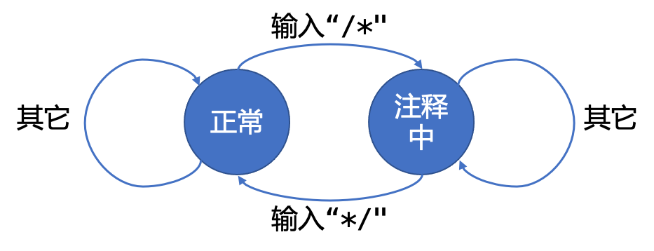

## 1. 实现的内容

1. 实现了C99标准中的除下划线开头的关键字以外的所有关键字的词法识别

   关键字列表位于[https://en.cppreference.com/w/c/keyword](https://en.cppreference.com/w/c/keyword)

2. 实现了整数、浮点数（含传统`[x].[y]`与指数形式科学计数法`[x].[y]e[z]`）两种形式、字符(char)、字符数组、8进制数、16进制数的常量识别。

3. 实现了识别单行注释`//`与多行注释`/* */`。并在词法分析中可以跳过。

4. 实现了数组与结构体的识别。

5. 实现了统计源程序中的语句行数、各类单词的个数、字符总数，并输出统计结果。

6. 实现了检查源程序中存在的词法错误，并报告错误所在的位置。

7. 实现了对错误进行适当的恢复，跳过错误继续进行词法分析，用一次扫描报告源程序中存在的所有词法错误以及错误位置。

8. 采用了递归下降方法。

## 2. 语言说明

### 词法分析的整体框架

该部分代码位于`src/lexical_parser.hpp`中：

其中，`ptr`为正在读取的代码的指针。


可以看出，我将这些部分分为了以下3类：

1. 三类词法的识别
   1. 标识符
   2. 运算符
   3. 数值
2. 注释的识别
3. 空白字符的识别（跳过然后保持状态即可）

### 三类词法

该词法分析器将所识别的文本分为**符号**、**数值常量**、**运算符**三类。其中他们的开始字符各不相同，因此我们只需要在读取到不同起始字符的时候进行不一样的处理即可。

- 符号(Symbol)的文法表示：

  在C99标准中，C语言的符号为`_`或**英文字母**作为起始字符。

  之后可包括**数字**、**英文字母**、**下划线**三种文字，也可为空。

  归纳为文法表示如下：

  ```
  <Symbol字符>→<'_'>|<数字>|<英文字母>
  <Symbol起始字符>→<'_'>|<英文字母>
  <Symbol中间部分>→Ɛ|<Symbol字符><Symbol中间部分>
  <Symbol>→<Symbol起始字符>|<Symbol中间部分>
  ```

  这样的形式，在处理完了首字母作为开始字符以后，我们可以用一个简单的C++函数读取出来：

  ```cpp
  int read_keyword(const char *str) { // 由英文字母或者下划线开始后调用这个函数
    int offset = 0;
    while (isdigit(*str) || isalpha(*str) || *str == '_') {
      str ++;
      offset ++;
    }
    return offset; // 返回符号的长度
  }
  ```

- 数值常量的文法表示：

  对于数值常量，我们需要分为以下几类：

  - 十六进制常量：以0x开始的数字。十六进制部分字符包括0...9,a...f

    ```
    <hex字符>→<数字>|<'a'>|<'b'>|<'c'>|<'d'>|<'e'>
    <hex数字部分>→<hex字符>|(Ɛ|<hex数字部分>)
    <十六进制常量>→<'0'><'x'><hex数字部分>
    ```

  - 八进制常量：以0开始的数字，八进制部分字符包括0...7

    ```
    <oct字符>→0...7
    <oct数字部分>→<oct字符>(Ɛ|<oct数字部分>)
    <八进制常量>→<'0'><oct数字部分>
    ```

  - 十进制整数常量：不以0开始的数字，十进制部分字符包括0...9

    ```
    <十进制起始字符>→1...9
    <十进制数中间部分>→Ɛ|(<数字><十进制数中间部分>)
    <十进制整数常量>→<十进制起始字符><十进制数中间部分>
    ```

  - 浮点数常量：形如`123.456`或`123.456e-789`

    ```
    <简单浮点数>→<整数>|(<'.'><非负整数>)
    <浮点数常量>→<简单浮点数>|(<'e'><整数>)
    ```

  - 字符常量：形如`'a'`或`'\a'`（考虑转义符）

    ```
    <字符常量>→'(<'\'><所有ASCII字符>|<除单引号外的所有ASCII字符>)'
    ```

  - 字符数组常量：形如`"Hello World\n"`（也需要考虑转义符）

    ```
    <内部字符串>→Ɛ|((<'\'><所有ASCII字符>|<除单引号外的所有ASCII字符>)|<内部字符串>)
    <字符数组常量>→"<内部字符串>"
    ```

    总结来说，所有的数字开头不外乎就是**数字**、**双引号**`"`、**单引号**`'`，因此我们用C++可以编写以下函数进行解析：

    ```cpp
    enum value_type {
      ERROR_TYPE,INT,FLOAT,STR,OCT,HEX,CHAR
    };
    struct value_result {
      value_type type;
      const char *value;
      int valuelen;
    };
    int parse_value(const char *str,value_result &ret) {
      ret.type = ERROR_TYPE;
      ret.value = str;
      int &offset = ret.valuelen = 0;
      if (str[0] == '\'') { // 检测到字符常量
        ret.type = CHAR;
        if (str[2] == '\'') { // 考虑'a'的形式
          offset = 3;
        }
        else {
          if (str[1] == '\\' && str[3] == '\'') { //考虑'/a'的形式
            offset = 4;
          }
          else {
            ret.type = ERROR_TYPE;
          }
        }
        return offset;
      }
      else if (str[0] == '"') { // 检测到字符串（字符数组）常量
        offset ++;
        bool last_zy = false;
        while (str[offset] && str[offset] != EOF && (last_zy || str[offset] != '"')) {
          last_zy = (str[offset] == '\\'); // 考虑转义符，例如\"不应该认为是字符串结束
          offset ++;
        }
        if (str[offset] == EOF || str[offset] == 0) { // 处理读取到终点，防止缓冲区溢出
          ret.type = ERROR_TYPE;
        }
        else {
          offset ++;
          ret.type = STR;
          ret.valuelen = offset;
        }
        return offset;
      }
      else if (isdigit(str[0]) || str[0] == '-') {// 检测到数值常量
        ret.type = INT;
        bool neg = str[0] == '-';
        if (neg) offset ++;
        while (str[offset] && str[offset] != EOF) {
          if (str[offset] == '-') { //根据特殊定位符处理数值类型
            if (str[offset-1] != 'e') break;
          }
          else if (str[offset] == '.') {
            ret.type = FLOAT;
          }
          else if (str[offset] == 'e') {
            ret.type = FLOAT;
          }
          else if (str[offset] == '0' && offset == neg) {
            ret.type = OCT;
          }
          else if (str[offset] == 'x') {
            ret.type = HEX;
          }
          else if (!isdigit(str[offset])) {
            // 如果不是16进制还出现了其它字符，那么就认为可能是到达了边界，直接停止
            if (!(ret.type == HEX && 
                  (
                    (str[offset] >= 'a' && str[offset] <= 'f') || 
                    (str[offset] >= 'A' && str[offset] <= 'F'))
                 )
               ) {
              break;
            }
          }
          offset ++;
        }
        if (ret.type == OCT) {
          // 考虑八进制数如果出现了别的数字的情况
          for (int i=1;i<offset;i++) if (str[i] == '8' || str[i] == '9') {
            ret.type = ERROR_TYPE;
          }
        }
        return offset;
      }
      else {
        return 1; // 不可能出现这种情况，但还是返回一个值来跳过这里
      }
    }
    ```

- 运算符的文法表示：

  运算符的识别比较复杂，因为运算符可能存在运算符本身是其它运算符的前缀的情况，例如"<<="与"<<"，这就需要在识别的时候确定确切的运算符起始位置。因此我们考虑先定义运算符列表，然后在后续将匹配过程在**Trie树**（字典树）上进行状态转移。

  Trie树结构如下：（这里只画了以`<`开始的部分，其中蓝色表示普通节点，橙色表示可以识别为符号的节点）

  

  匹配的过程我们只需要逐字读入运算符，然后不断更新在Trie树上最长匹配到的运算符，当树上无法继续转移状态的时候退出函数然后返回匹配到的运算符即可。

  Trie树关键代码如下，位于我的程序中的`src/op_trie.hpp`中的`class opTrie`

  ```cpp
  struct Node {
    Node *ch[128];
    bool exist;
    Node() {
      exist = false;
      for (int i=0;i<128;i++) ch[i] = NULL;
    }
  };
  int query(const char *s) {
    int maxlen = 0;
    Node *cur = root;
    int curlen = 0;
    while (*s) {
      if (*s & 128) break;
      if (cur->ch[*s]) {
        cur = cur->ch[*s];
        curlen ++;
        if (cur->exist) maxlen = curlen;
      }
      else {
        break;
      }
      s ++;
    }
    return maxlen;
  }
  ```

  这里我定义的运算符列表如下：

  ```cpp
  std::set <std::string> ops = std::set <std::string> ({
    "+","-","*","/","<",">","==",
    "!=","<<",">>","++","--","&&",
    "||","&","|","^","!","~",">=",
    "<=","?",":","=","+=","-=","*=",
    "/=","<<=",">>=","&=","|=","^=",
    "."
  });
  ```

  基于以上文法表示，我们就可以将代码中需要提取的运算符提取出来。

### 注释

之后，我们还需要特殊处理注释，注释处理如下：

- 单行注释

  单行注释的特点是，以`//`为开始（在字符串中的`"//"`不会被作为注释识别），以换行符(`\n`)为结束。

  我们可以采用以下有限状态机(FSM)进行表示：

  

- 多行注释

  多行注释的特点是，以`/*`为开始，直到出现`*/`为结束。

  同样可以采用以下FSM表示：

  

此外，还要考虑到用户定义符号，如**变量声明**、**函数声明**、**结构体与联合体的声明**，这一部分将在符号表进行介绍。

## 3. 词类编码表

在词法分析程序中，我采用的方法是先定义各种类型的词法表，然后遍历该表插入到词类编码表中，最后生成结果如下：

| 编码 | 词       | 编码 | 词     | 编码 | 词       | 编码 | 词       |
| ---- | -------- | ---- | ------ | ---- | -------- | ---- | -------- |
| 0    | const    | 1    | extern | 2    | inline   | 3    | register |
| 4    | restrict | 5    | static | 6    | volatile | 7    | auto     |
| 8    | char     | 9    | double | 10   | enum     | 11   | float    |
| 12   | int      | 13   | long   | 14   | short    | 15   | signed   |
| 16   | struct   | 17   | union  | 18   | unsigned | 19   | void     |
| 20   | break    | 21   | case   | 22   | continue | 23   | default  |
| 24   | do       | 25   | else   | 26   | for      | 27   | goto     |
| 28   | if       | 29   | return | 30   | sizeof   | 31   | switch   |
| 32   | typedef  | 33   | while  | 34   | getchar  | 35   | printf   |
| 36   | putchar  | 37   | scanf  | 38   | !        | 39   | !=       |
| 40   | &        | 41   | &&     | 42   | &=       | 43   | *        |
| 44   | *=       | 45   | +      | 46   | ++       | 47   | +=       |
| 48   | -        | 49   | --     | 50   | -=       | 51   | .        |
| 52   | /        | 53   | /=     | 54   | :        | 55   | <        |
| 56   | <<       | 57   | <<=    | 58   | <=       | 59   | =        |
| 60   | ==       | 61   | >      | 62   | >=       | 63   | >>       |
| 64   | >>=      | 65   | ?      | 66   | ^        | 67   | ^=       |
| 68   | \|       | 69   | \|=    | 70   | \|\|     | 71   | ~        |
| 72   | ,        | 73   | ;      | 74   | (        | 75   | )        |
| 76   | [        | 77   | ]      | 78   | {        | 79   | }        |
| 80   | sym      | 81   | val    |      |          |      |          |

其中，最后的"sym"与"val"分别指代用户定义的符号以及用户定义的常量数值。

用于生成词类编码表的词集合如下，位于我的代码中的`src/init_lexical.hpp`

```cpp
std::set <std::string> type_qualifiers = std::set <std::string> ({
  "const","static","volatile","register","inline","extern",
  "restrict"
});
std::set <std::string> types = std::set <std::string>({
  "void","int","long","short","float","double","char",
  "unsigned","signed","struct","union","auto","enum"
});
std::set <std::string> keys = std::set <std::string> ({
  "if","else","goto","switch","case","do","while","for",
  "continue","break","return","default","sizeof","typedef"
});
std::set <std::string> builtin_functions = std::set <std::string> ({
  "getchar","putchar","scanf","printf"
});
std::set <std::string> ops = std::set <std::string> ({
  "+","-","*","/","<",">","==","!=","<<",">>","++","--","&&",
  "||","&","|","^","!","~",">=","<=","?",":","=","+=","-=","*=",
  "/=","<<=",">>=","&=","|=","^=","."
});
std::set <char> control_ops = std::set<char> ({
  ',',';'
});
std::set<std::pair<char,char> > control_ops_pairwise = 
  std::set<std::pair<char,char> >({
    {'{','}'},
    {'(',')'},
    {'[',']'}
  });
```

## 4. 符号表

处理符号表之前，需要先考虑用户自定义符号的识别：

### 变量的定义（含数组）

这里我们规定变量定义文法形式如下：

```
<指针>→Ɛ|(<'*'>|<指针>)
<数组>→Ɛ|(<'['><正整数><']'>|<数组>)
<变量符号串>→(Ɛ|<数组>)<symbol>(Ɛ|<'='><表达式>)|(<','><变量符号串>)
<变量类型>→<C语言预置类型>|((<'struct'>|<'union'>) <'用户定义的类型符号'>)
<变量的定义>→<变量类型> <变量符号串>;
```

这样，形如简单的`int a = 1,b = 2;`或者复杂如`struct DATA *a[12],*b[34]`都可以包含在这样的文法定义中。

### 结构体的定义

```
<多变量的定义>→<变量的定义>|(Ɛ|<多变量的定义>)
<结构体的定义>→<'struct'> <结构体名称(作为Symbol识别)> <'{'> <多变量的定义> <'}'>
```

### 函数的定义

我们规定函数定义文法形式如下：

```
<数组>→Ɛ|(<'['><正整数><']'>|<数组>)
<变量类型>→<C语言预置类型>|((<'struct'>|<'union'>) <'用户定义的类型符号'>)
<单变量的定义>→<变量类型> (Ɛ|<数组>)<symbol>(Ɛ|<'='><表达式>)
<参数的定义>→Ɛ|<单变量的定义>(Ɛ|<,><参数的定义>)
<函数的定义>→<变量类型>|(Ɛ|<'*'>) <函数名(作为Symbol识别)> <'('><参数的定义><')'> (<';'>|<'{'><函数内部内容><'}'>)
```

这样，形如简单的：

```cpp
int sum(int a,int b);
```

或是以下这种：

```cpp
struct result process(struct input *a,struct input *b) {
  // do something
}
```

都可以被我们的文法定义所涵盖识别。

### 代码

结合以上定义，我们可以同时考虑处理定义时的状态转移，编写C++代码如下：

```cpp
// char *ptr为当前读取源代码位置的指针
// string name_of_type 用于临时存储当前正在识别的类型
// bool upd_name_of_type用于记录name_of_type是否更新，若不更新将会在这一步读取完后清空
// pair <string,string> symbol_ready_commit 用于处理结构体和联合体的延迟加入符号表
// string last_def_symbol_name 上次读取到的用于定义的符号名称，用于处理函数的定义加入符号表
if (isalpha(*ptr) || *ptr == '_') { // 识别标识符
  off = read_keyword(ptr); // 递归下降，读取标识符，返回对应标识符的长度
  string tmp = genstring(ptr,off); // 获取标识符，转换为字符串
  if (types.find(tmp) != types.end()) { // 如果当前读取的标识符识别为类型
    name_of_type = tmp; // 更新name_of_type变量，用于后续对函数定义以及
    upd_name_of_type = true; // 设置一个bool变量表名这次更新了name_of_type，在最后不对它进行清空
    lexicals.add_count(lexicals.get_lexical_number(tmp)); // 对于该symbol的统计++，用于最后打印统计结果
    printf("(%02d,NULL)",lexicals.get_lexical_number(tmp)); // 输出该符号二元组
  }
  else {
    if (name_of_type != "") { // 识别为正在定义符号（注意特殊处理struct和union）
      if (name_of_type == "struct" || name_of_type == "union") { // 类型更新为自定义类型
        if (symbols.has_defined(tmp)) { // 如果是一个已经被定义的struct或者union，那么就认为是正在使用该struct或者union的名称
          lexicals.add_count(lexicals.get_lexical_number("sym"));
          printf("(%02d,%03d)",lexicals.get_lexical_number("sym"),symbols.get_symbol_id(tmp));
        }
        else { // 这种情况下说明正在定义struct或者union，需要等待识别到大括号{以后再加入符号表
          symbol_ready_commit = make_pair(name_of_type,tmp); 
        }
        name_of_type = tmp;
        upd_name_of_type = true;
      }
      else {
        if (types.find(name_of_type) != types.end() || symbols.has_struct_or_union(name_of_type)) { // 检测该类型是否已经定义
          if (lexicals.lexical_exist(tmp)) errors.raise_error(line_number,ptr-linestart,"symbol already defined in the lexicals."); // 检测正在定义的符号是否与先前定义的符号存在冲突
          else if (symbols.has_defined(tmp)) errors.raise_error(line_number,ptr-linestart,"symbol already defined");
          else {
            int inserted_id = symbols.insert(name_of_type+genptr_level(ptr_level),tmp); // 插入符号表
            lexicals.add_count(lexicals.get_lexical_number("sym"));
            printf("(%02d,%03d)",lexicals.get_lexical_number("sym"),inserted_id);
            last_def_symbol_name = tmp;
            upd_name_of_type = true; // 暂时保留类型，处理逗号之后继续定义的情况
          }

        }
        else {
          lexicals.add_count(lexicals.get_lexical_number("sym"));
          printf("(%02d,?)",lexicals.get_lexical_number("sym"));
          errors.raise_error(line_number,ptr-linestart,"undefined type \"" + string(tmp) + "\"."); // 检测到没有定义的类型
        }
      }
    }
    else {
      // 直接翻译为对应词法
      if (lexicals.lexical_exist(tmp)) {
        lexicals.add_count(lexicals.get_lexical_number(tmp));
        printf("(%02d,NULL)",lexicals.get_lexical_number(tmp));
      }
      else if (symbols.has_defined(tmp)) {
        lexicals.add_count(lexicals.get_lexical_number("sym"));
        printf("(%02d,%03d)",lexicals.get_lexical_number("sym"),symbols.get_symbol_id(tmp));
      }
      else {
        printf("(?,?)");
        errors.raise_error(line_number,ptr-linestart,string("undefined symbol \"") + tmp + string("\"."));
      }
    }
  }
}
```

而对于函数定义以及结构体定义，我们相应地需要延迟更新，这里考虑两种字符。函数定义后一定存在`(`，而结构体定义后一定存在`{`，因此就可以在读取到对应字符的时候完成延迟更新操作。

- 对于函数定义的延迟加入符号表：

  在读取到`(`时进行

  ```cpp
  if (tmp == "(") {
    if (last_def_symbol_name != "") {
      symbols.append_type(last_def_symbol_name," func");
    }
    // ... 省略其它对于(的处理
  }
  ```

- 对于结构体的定义延迟加入符号表：

  在读取到`{`时进行

  ```cpp
  if (tmp == "{") {
    if (symbol_ready_commit != make_pair(string(""),string(""))) {
      if (lexicals.lexical_exist(symbol_ready_commit.second)) errors.raise_error(line_number,ptr-linestart,"symbol already defined in the lexicals.");
      else {
        int inserted_id = symbols.insert(symbol_ready_commit.first,symbol_ready_commit.second);
        lexicals.add_count(lexicals.get_lexical_number("sym"));
        printf("(%02d,%03d,%s)",lexicals.get_lexical_number("sym"),inserted_id,symbol_ready_commit.second.c_str());
      }
      symbol_ready_commit = make_pair(string(""),string(""));
    }
    // ... 省略其它对于{的处理
  }
  ```

### 符号表的输出

对于提交的测试程序`testcase1.c`，符号表统计输出结果如下：


可以看到，这里正确处理了结构体、数组、函数的识别。

## 5. 常量表

常量的具体识别方式已经在第二部分语言说明的三类词法中进行描述并展示了关键代码，这里继续展示如何对常量进行管理。

位于我代码的`src/value_manager.hpp`文件编写了一个常量管理器，它的操作非常简单，就是以字符串形式插入常量以及记录常量的类型以及id号，以便事后用到的时候进行查询以及最后的打印。

同时，我做了一个简单的优化：

如果两个常量定义的字符串相同，那么插入的时候会直接进行匹配，直接重复使用对应的ID号，这样在后续编译的时候可以节省程序所需的空间。

常量管理器如下：

```cpp
class value_manager { // 用于管理所有出现的值
  public:
  int insert(string type, string value) {
    if (value_id.find(value) != value_id.end()) return value_id[value]; // 前面提到的优化
    else {
      value_id[value] = all_value.size();
      all_value.push_back(make_pair(type,value));
      return value_id[value];
    }
  }
  void print_all() {
    printf("----- Const Table BEGIN -----\n");
    printf("|No.|  Type  | Value \n");
    printf("-----------------------------\n");
    for (int i=0;i<all_value.size();i++) {
      printf("|%03d|%*s|%s\n",i,8,all_value[i].first.c_str(),all_value[i].second.c_str());
    }
    printf("----- Const Table  END  -----\n");
  }
  private:
  vector <pair<string,string> > all_value;
  map <string,int> value_id; // 对于value，value一定能对应到type以及id，因此这里只存储value
};
```

最后，以我的`testcase1.c`为例，打印出来的常量如下：


## 6. 错误处理

对于词法错误处理，我的程序实现了在发现错误之后记录错误，然后对现有状态进行恢复。

而在词法分析中，错误处理的恢复非常简单，分为以下两种问题：

1. 正在定义变量、函数、结构体：清空已有的类型状态信息
2. 括号不匹配时，且右括号比左括号多：将统计清零，重新开始统计，如果只有这一个右括号是多打的即可不影响后续处理。

我实现了以下词法错误的识别（记录了对应程序源代码位置以及行号）：

1. 正在定义的Symbol与内置词法冲突。`src/lexical_parser.hpp:106`
2. 正在定义的Symbol已经被定义过。`src/lexical_parser.hpp:107,src/lexical_parser.hpp:195`
3. 识别为正在定义结构体或联合体变量，但是之前该结构体或联合体没有被声明。`src/lexical_parser.hpp:123`
4. 正在使用某个Symbol，但之前没有被使用。`src/lexical_parser.hpp:157`
5. 检测到运算符，但无法与任何已知运算符匹配上。`src/lexical_parser.hpp:169`
6. 括号不匹配：
   1. `()`不匹配：
      - 中途出现右括号比左括号多的情况：`src/lexical_parser.hpp:190`
      - 当遇到语句结束符`;`时，括号没有匹配：`src/lexical_parser.hpp:225`
   2. `[]`不匹配：
      - 中途出现右括号比左括号多的情况：`src/lexical_parser.hpp:219`
      - 当遇到语句结束符`;`时，括号没有匹配：`src/lexical_parser.hpp:225`
   3. `{}`不匹配：
      - 中途出现右括号比左括号多的情况：`src/lexical_parser.hpp:208`
      - 当程序结束时，大括号也未能匹配：`src/lexical_parser.hpp:274`
7. 输入无法匹配现有词法库的任何Pattern。`src/lexical_parser.hpp:258`

然后，我编写了一个`error_manager`类，它完成了对源程序的扫描，区分出代码的每一行，然后在顺序解析代码的时候可以调用这个类的成员函数来进行`raise_error(int line,int col,string msg)`。当调用了`raise_error`后，这个`error_manger`会将输入存储在一个`std::vector<tuple<int,int,string> >`中，在最后调用输出函数时对所有错误信息进行输出。

这里还做了一个小trick，我们经常使用`gcc`或者`clang`的时候，能看到错误信息中有不同的颜色：


经过查阅资料后发现这是使用ANSI Escape Code实现的，因此在我在输出错误信息的时候充分考虑了这一点。

输入部分代码如下：

```cpp
void print_err() {
  for (auto cur : errors) {
    int line, col;
    string msg;
    tie(line,col,msg) = cur;
    cerr << "\n\033[0;31merror\033[0m: line " << line << ", col " << col << ", " << msg << "\n";
    if (line-1 < lines.size()) {
      for (auto c:lines[line-1]) {
        if (c == '\t') cerr << "    "; // 对制表符特殊处理，美化输出结果
        else cerr << c;
      }
      cerr << "\n";
      for (int i=0;i<col;i++) {
        if (lines[line-1][i] == '\t') {
          cerr << "   ";
        }
        if (i != col-1) cerr << " ";
      }
      cerr << "\033[0;32m^\033[0m\n";
    }
  }
}
```

其中，`0;31`是红色，`0`是恢复正常颜色，`0;32`是绿色。

最后实现了输出形式如下：


可以看到，这里我成功仿照了`clang`的错误颜色风格，生成了带有颜色的错误信息。并正确识别了源文件中所包括的全部的以上几种错误类型，与`clang`识别的错误相比只多不少。

## 7. 程序说明

程序代码文件结构：


程序代码文件结构如下：

其中`main.cpp`是程序的入口，它负责读入要分析的程序然后调用`lexical_parser`进行分析，最后输出相应的统计信息、各种表格、以及错误信息。

`testcase[1-3].c`是程序的测试用例，如下：

1. `testcase1.c`是一个正确的C语言程序。
2. `testcase2.c`是在`testcase1.c`的基础上通过注释取消一些函数的声明，然后加入一些其他的错误而成的错误程序。
3. `testcase3.c`是词法表测试程序，它只包含我们的词法分析器支持的所有词法，没有任何完整的语句。

此外，我还编写了`Makefile`来方便编译，使得老师和助教可以在安装了gcc后直接使用Make来编译我的程序并执行测试，`Makefile`编写如下：

```makefile
lexical_analyzer: src/main.cpp
	g++ -std=c++17 src/main.cpp -o lexical_analyzer -fsanitize=address

.PHONY: test1 test2 test3 test clean
test1: lexical_analyzer testcase1.c
	@echo "Testing Testcase1.c"
	@./lexical_analyzer < testcase1.c

test2: lexical_analyzer testcase2.c
	@echo "Testing Testcase2.c"
	@./lexical_analyzer < testcase2.c

test3: lexical_analyzer testcase3.c
	@echo "Testing Testcase3.c"
	@./lexical_analyzer < testcase3.c

test: lexical_analyzer testcase1.c testcase2.c testcase3.c
	@echo "Testing Testcase1.c"
	@./lexical_analyzer < testcase1.c
	@echo "Testing Testcase2.c"
	@./lexical_analyzer < testcase2.c
	@echo "Testing Testcase3.c"
	@./lexical_analyzer < testcase3.c

clean:
	rm lexical_analyzer
```

可以使用以下命令：

- `make`：生成`lexical_analyzer`二进制可执行文件
- `make test`：运行我预置的三个词法测试
- `make clean`：删除`lexical_analyzer`二进制可执行文件
- `make test[1-3]`：单独运行1-3之中的任何一个词法测试